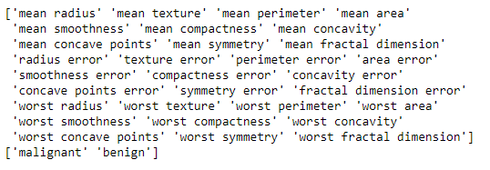
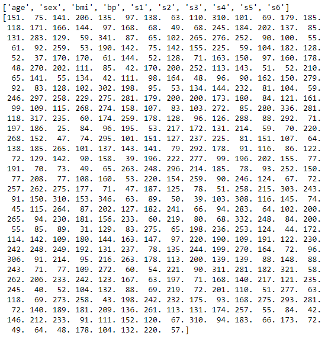
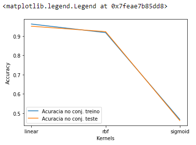
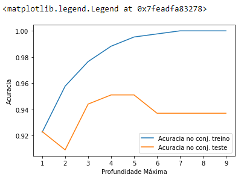
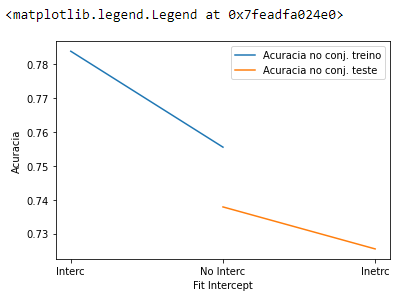

<h1 align='center'>Cap 6 - Representação da Incerteza</h1>

```
from sklearn.datasets import load_breast_cancer
from sklearn.datasets import load_diabetes
from sklearn import svm
from sklearn.tree import DecisionTreeClassifier
from sklearn.linear_model import LinearRegression
from sklearn.model_selection import train_test_split
import matplotlib.pylab as plt
%matplotlib inline
```

<br><hr><br>

```
dataset_cancer = load_breast_cancer()
print (dataset_cancer.feature_names)
print (dataset_cancer.target_names)
```


<br><hr><br>

```
dataset_diabetes = load_diabetes()
print (dataset_diabetes.feature_names)
print (dataset_diabetes.target)
```


<br><hr><br>

```
X_train_can, X_test_can, y_train_can, y_test_can = train_test_split(dataset_cancer.data, dataset_cancer.target, stratify=dataset_cancer.target, random_state=42)
X_train_dia, X_test_dia, y_train_dia, y_test_dia = train_test_split(dataset_cancer.data, dataset_cancer.target, stratify=dataset_cancer.target, random_state=42)
```

<br><hr><br>

```
# SVM
training_accuracy = []
test_accuracy = []

kernels = ['linear', 'rbf', 'sigmoid']
for kernel in kernels:
    svm_model = svm.SVC(kernel=kernel)
    
    svm_model.fit(X_train_can, y_train_can)
    training_accuracy.append(svm_model.score(X_train_can, y_train_can))
    test_accuracy.append(svm_model.score(X_test_can, y_test_can))
    
plt.plot(kernels, training_accuracy, label='Acuracia no conj. treino')
plt.plot(kernels, test_accuracy, label='Acuracia no conj. teste')
plt.ylabel('Accuracy')
plt.xlabel('Kernels')
plt.legend()
```


<br><hr><br>

```
# DECISION TREE
training_accuracy = []
test_accuracy = []

prof_max = range(1, 10)

for md in prof_max:
    tree = DecisionTreeClassifier(max_depth=md, random_state=0)
    tree.fit(X_train_can, y_train_can)
    training_accuracy.append(tree.score(X_train_can, y_train_can))
    test_accuracy.append(tree.score(X_test_can, y_test_can))
    
plt.plot(prof_max, training_accuracy, label='Acuracia no conj. treino')
plt.plot(prof_max, test_accuracy, label='Acuracia no conj. teste')
plt.ylabel('Acuracia')
plt.xlabel('Profundidade Máxima')
plt.legend()
```


<br><hr><br>

```
# REGRESSÃO LINEAR
training_accuracy = []
test_accuracy = []

for interception in [True, False]:
    regr = LinearRegression(fit_intercept=interception)
    regr.fit(X_train_dia, y_train_dia)
    training_accuracy.append(regr.score(X_train_dia, y_train_dia))
    test_accuracy.append(regr.score(X_test_dia, y_test_dia))
    
plt.plot(["Interc", "No Interc"], training_accuracy, label='Acuracia no conj. treino')
plt.plot(["Inetrc", "No Interc"], test_accuracy, label='Acuracia no conj. teste')
plt.ylabel('Acuracia')
plt.xlabel('Fit Intercept')
plt.legend()
```

